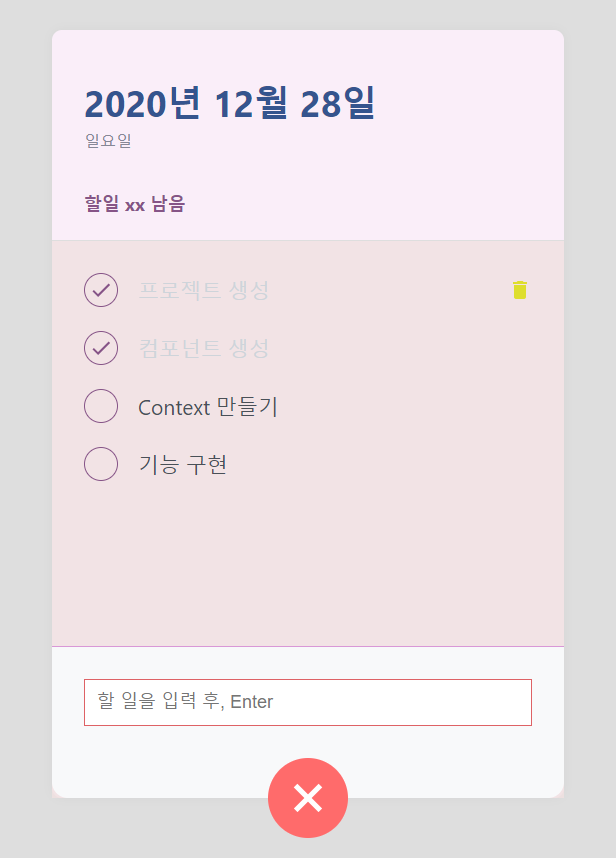

공부했던 내용들을 토대로 ToDoList 를 만들어보려고 한다. 
먼저 styled-components 랑 react-icons 를 깔자.

```yarn add styled-components react-icons```

먼저 만들어야할 컴포넌트를 생각해보면 다음과 같다. 

1. 전체적인 레이아웃 (TodoTemplate)
2. 요일, 날짜, 남은 것의 개수등 헤더부분 (TodoHead)
3. 해야할 일에 대한 정보들이 들어있는 부분 (TodoList, TodoItem)
4. 새로 추가할 수 있는 버튼이 있는 부분, 푸터 (TodoCreate)

하나씩 만들어보자.

먼저 `styled-components` 의 `createGlobalStyle` 를 사용하면 스타일을 전역으로 설정할 수 있다.

```javascript
//App.js
import { createGlobalStyle } from "styled-components";

//전역으로 넣어주고 싶은 스타일
const GlobalStyle = createGlobalStyle`
  body{
    background-color:#dedede;
  }
`;

function App() {
  return (
    <>
      <GlobalStyle></GlobalStyle>
      <div>안녕하세요</div>
    </>
  );
}
```

변수를 설정 한 후 아무곳이나 넣어주면 된다. 물론 그냥 CSS 파일에 설정해도 상관은 없다.

이후 전체적인 틀을 만들어줬다.

```javascript
//App.js
import React from "react";
import { createGlobalStyle } from "styled-components";
import TodoCreate from "./components/TodoCreate";
import TodoHead from "./components/TodoHead";
import TodoList from "./components/TodoList";
import TodoTemplateBlock from "./components/TodoTemplate";

const GlobalStyle = createGlobalStyle`
  body{
    background-color:#dedede;
  }
`;

function App() {
  return (
    <>
      <GlobalStyle></GlobalStyle>
      <TodoTemplateBlock>
        <TodoHead></TodoHead>
        <TodoList></TodoList>
        <TodoCreate></TodoCreate>
      </TodoTemplateBlock>
    </>
  );
}

export default App;

//TodoHead.js
import React from "react";
import styled from "styled-components";

const TodoHeadBlock = styled.div`
  padding: 48px 32px 24px;
  border-bottom: 1px solid #dedede;

  h1 {
    margin: 0;
    font-size: 36px;
    color: #35548e;
  }

  .day {
    margin-top: 4px;
    color: #868796;
  }

  .task-left {
    margin-top: 40px;
    font-size: 18px;
    font-weight: bold;
    color: #865487;
  }
`;

function TodoHead() {
  return (
    <TodoHeadBlock>
      <h1>2020년 12월 28일</h1>
      <div className="day">일요일</div>
      <div className="task-left">할일 xx 남음</div>
    </TodoHeadBlock>
  );
}

export default TodoHead;

//TodoTemplate.js
import React from "react";
import styled from "styled-components";

const TodoTemplateBlock = styled.div`
  position: relative;
  display: flex;
  flex-direction: column;

  width: 512px;
  height: 768px;
  margin: 96px auto 32px;

  background-color: #faeef9;
  border-radius: 10px;
  box-shadow: 0 0 10px rgba(0, 0, 0, 0.04);
`;

function TodoTemplate({ children }) {
  return <TodoTemplateBlock>{children}</TodoTemplateBlock>;
}

export default TodoTemplate;

//TodoList.js
import React from "react";
import styled from "styled-components";
import TodoItem from "./TodoItem";

const TodoListBlock = styled.div`
  flex: 1;
  padding: 20px 32px 48px;
  overflow-y: auto;
  background-color: #f1e1e1d6;
`;

function TodoList() {
  return (
    <TodoListBlock>
      <TodoItem text="프로젝트 생성" done={true}></TodoItem>
      <TodoItem text="컴포넌트 생성" done={true}></TodoItem>
      <TodoItem text="Context 만들기" done={false}></TodoItem>
      <TodoItem text="기능 구현" done={false}></TodoItem>
    </TodoListBlock>
  );
}

export default TodoList;


//TodoItem.js
import React from "react";
import styled, { css } from "styled-components";
import { MdDone, MdDelete } from "react-icons/md";

const Remove = styled.div`
  opacity: 0;
  display: flex;
  align-items: center;
  justify-content: center;
  color: #dede2e;
  font-size: 24px;
  cursor: pointer;

  ${(props) =>
    props.done &&
    css`
      border: 1px solid #38d9ea;
      color: #38d9a9;
    `}

  &:hover {
    color: #ff6b6b;
  }
`;

const CheckCircle = styled.div`
  display: flex;
  align-items: center;
  justify-content: center;
  margin-right: 20px;
  cursor: pointer;
  width: 32px;
  height: 32px;
  border-radius: 50%;
  border: 1px solid #865487;
  font-size: 24px;
  color: #865487;
`;
const Text = styled.div`
  flex: 1;
  font-size: 21px;
  color: #495057;
  ${(props) =>
    props.done &&
    css`
      color: #ced4da;
    `}
`;
const TodoItemBLock = styled.div`
  display: flex;
  align-items: center;
  padding-top: 12px;
  padding-bottom: 12px;

  &:hover {
    ${Remove} {
      opacity: 1;
    }
  }
`;

function TodoItem({ id, done, text }) {
  return (
    <TodoItemBLock>
      <CheckCircle done={done}>{done && <MdDone></MdDone>}</CheckCircle>
      <Text done={done}>{text}</Text>
      <Remove>
        <MdDelete></MdDelete>
      </Remove>
    </TodoItemBLock>
  );
}

export default TodoItem;

//TodoCreate.js
import React, { useState } from "react";
import styled, { css } from "styled-components";
import { MdAdd } from "react-icons/md";

const CircleBtn = styled.button`
  display: flex;
  position: absolute;
  left: 50%;
  bottom: 0;
  width: 80px;
  height: 80px;
  transform: translate(-50%, 50%);

  font-size: 60px;
  color: white;
  border-radius: 40px;
  border: none;
  outline: none;

  z-index: 5;
  cursor: pointer;
  background-color: #38d9a9;
  align-items: center;
  justify-content: center;

  &:hover {
    background-color: #63e6be;
  }
  &:active {
    background-color: #20c997;
  }

  transition: all 0.3s;
  ${(props) =>
    props.open &&
    css`
      background-color: #ff6b6b;
      &:hover {
        background-color: #ff8787;
      }
      &:active {
        background-color: #fa5252;
      }
      transform: translate(-50%, 50%) rotate(45deg);
    `};
`;

const InsertFormPostioner = styled.div`
  position: absolute;
  width: 100%;
  bottom: 0;
  left: 0;
`;

const InsertFrom = styled.div`
  background-color: #f8f9fa;
  padding: 32px;
  padding-bottom: 72px;
  border-bottom-left-radius: 16px;
  border-bottom-right-radius: 16px;
  border-top: 1px solid #d998d7;
`;

const Input = styled.input`
  width: 100%;
  padding: 12px;
  border: 1px solid #de6265;
  outline: none;
  font-size: 18px;
  box-sizing: border-box;
`;

function TodoCreate() {
  const [open, setOpen] = useState(false);
  const onToggle = () => {
    setOpen(!open);
  };
  return (
    <>
      <CircleBtn onClick={onToggle} open={open}>
        <MdAdd></MdAdd>
      </CircleBtn>
      {open && (
        <InsertFormPostioner>
          <InsertFrom>
            <Input placeholder="할 일을 입력 후, Enter" autoFocus></Input>
          </InsertFrom>
        </InsertFormPostioner>
      )}
    </>
  );
}

export default TodoCreate;

```


***


#### Context API 를 활용한 상태관리

Context API 를 사용하면 App.js 를 통하지 않고 필요한 함수와 상태관리 등을 각 컴포넌트에서 바로바로 처리 할 수 있다.
Context API 를 사용하기 위해 첫번째로 Context 파일을 만들고 리듀서를 만들어줘야 한다.

```javascript
//TodoContext.js

import React, { useReducer } from "react";

//프로젝트에서 사용할 초기 상태

const initialTodos = [
  {
    id: 1,
    text: "프로젝트 생성",
    done: true,
  },
  {
    id: 2,
    text: "컴포넌트 스타일링",
    done: true,
  },
  {
    id: 3,
    text: "Context 만들기",
    done: false,
  },
  {
    id: 4,
    text: "기능 구현",
    done: false,
  },
];

/* Create, Toggle, Remove */

function todoReducer(state, action) {
  switch (action.type) {
    case "CREATE":
      return state.concat(action.todo);
    case "TOGGLE":
      return state.map((todo) =>
        todo.id === action.id ? { ...todo, done: !todo.done } : todo
      );
    case "REMOVE":
      return state.filter((todo) => todo.id !== action.id);
    default:
      throw new Error(`Unhandled action type : ${action.type}`);
  }
}

export function TodoProvider({ children }) {
  const [state, dispatch] = useReducer(todoReducer, initialTodos);
  return children;
}
```

Create, Toggle, Remove 세가지 case 를 만들어 각 case 별로 배열을 업데이트 해줬다. 이제 Context 를 만들어야 하는데 state 를 위한 Context 와 dispatch 를 위한 Context, 그리고 넥스트 아이디를 관리하기 위한 Context 3개를 만드려고 한다.

```javascript
//TodoContext.js
const TodoStateContext = createContext();
const TodoDispatchContext = createContext();
//넥스트 아이디를 관리하는 콘택스트
const TodoNextIdContext = createContext();

export function TodoProvider({ children }) {
  const [state, dispatch] = useReducer(todoReducer, initialTodos);
  return (
    <TodoStateContext.Provider value={state}>
      <TodoDispatchContext.Provider value={dispatch}>
        <TodoNextIdContext.Provider value={nextId}>
          {children}
        </TodoNextIdContext.Provider>
      </TodoDispatchContext.Provider>
    </TodoStateContext.Provider>
  );
}
```

이제 만들어 놓은 콘택스트를 외부에서 사용하기 위해 커스텀 훅을 만들어준다. 물론 외부에서 `const state = useContext(TodoStateContext);` 라고 사용하는 방법도 있다.

```javascript
//TodoContext.js
export function useTodoState() {
  const context=useContext(TodoStateContext);
  if(!context){
    throw new Error("Cannot find TodoProvider")
  }
  return useContext(TodoStateContext);
}

export function useTodoDispatch() {
  const context=useContext(TodoDispatchContext);
  if(!context){
    throw new Error("Cannot find TodoProvider")
  }
  return useContext(TodoDispatchContext);
}

export function useTodoNextId() {
  const context=useContext(TodoNextIdContext);
  if(!context){
    throw new Error("Cannot find TodoProvider")
  }
  return useContext(TodoNextIdContext);
}
```

에러처리를 위해 if 문으로 감싸는 습관을 들이면 좋다.


#### 기능 구현하기

먼저 TodoHead 의 날짜와 요일을 가져오기 위해 javascript 의 <a href="https://developer.mozilla.org/ko/docs/Web/JavaScript/Reference/Global_Objects/Date" targe="_blank">DATE</a> 객체를 활용했다. 

그 후 남은 할 일 개수를 들고오기 위해 `TodoContext.js` 에서 작성한 `useTodoState` 를 사용해 개수를 구했다.

```javascript
///TodoHead.js
function TodoHead() {
  const todos = useTodoState();
  const undoneTasks = todos.filter((todo) => !todo.done);

  const today = new Date();
  const dateString = today.toLocaleDateString("ko-KR", {
    year: "numeric",
    month: "long",
    day: "numeric",
  });
  const dateName = today.toLocaleDateString("ko-KR", {
    weekday: "long",
  });
  return (
    <TodoHeadBlock>
      <h1>{dateString}</h1>
      <div className="day">{dateName}</div>
      <div className="task-left">할일 {undoneTasks.length}개 남음</div>
    </TodoHeadBlock>
  );
}
```

이제 `TodoList.js` 에서 `useTodoState()` 를 사용해 각 todo 배열을 `TodoItem` 으로 변형해주면 되는데 이때 키값과 아이디값등 고유한 값을 잊지말고 넣어줘야 한다.


```javascript
//TodoList.js
function TodoList() {
  const todos = useTodoState();
  return (
    <TodoListBlock>
      {todos.map((todo) => (
        <TodoItem
          key={todo.id}
          id={todo.id}
          text={todo.text}
          done={todo.done}
        />
      ))}
    </TodoListBlock>
  );
}
```

`TodoItem.js` 에서는 `useTodoDispatch()` 를 사용해 onToggle 함수와 onRemove 함수를 만들어주면된다. 이때 마지막 부분에 `React.memo` 를 사용해주면 컴포넌트 최적화를 해줄 수 있다. 

마지막으로 `TodoCreate.js` 도 같은 방식으로 해주면 되는데 이때 기존의 `InsertFrom` 를 div 에서 form 으로 바꿔준다. html 에서는 기본적으로 submit 이 되면 새로고침을 하게 되는데 이를 방지하기 위해 `preventDefault` 를 해주면 된다.

```javascript
//TodoCreate.js
function TodoCreate() {
  const [open, setOpen] = useState(false);
  const [value, setValue] = useState("");
  const dispatch = useTodoDispatch();
  const nextId = useTodoNextId();

  const onToggle = () => {
    setOpen(!open);
  };
  const onChange = (e) => {
    setValue(e.target.value);
  };
  const onSubmit = (e) => {
    e.preventDefault();
    dispatch({
      type: "CREATE",
      todo: {
        id: nextId.current,
        text: value,
        done: false,
      },
    });
    setValue("");
    setOpen(false);
    nextId.current += 1;
  };

  return (
    <>
      <CircleBtn onClick={onToggle} open={open}>
        <MdAdd></MdAdd>
      </CircleBtn>
      {open && (
        <InsertFormPostioner>
          <InsertFrom onSubmit={onSubmit}>
            <Input
              placeholder="할 일을 입력 후, Enter"
              autoFocus
              onChange={onChange}
              value={value}
            ></Input>
          </InsertFrom>
        </InsertFormPostioner>
      )}
    </>
  );
}

export default React.memo(TodoCreate);
```

